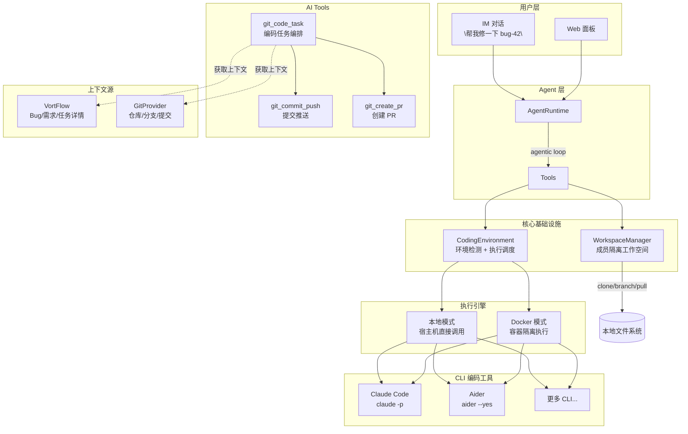

# AI 编码能力 — 对话驱动的代码修改与环境生成

> 状态：Phase 3a + 3b 已完成 | 创建日期：2026-03-01

## 一、整体架构

基于 VortGit Phase 3 扩展，新增 **编码执行环境（CodingEnvironment）** 作为核心基础设施层，**CLIRunner** 作为 CLI 编码工具统一调度层，**CodeTaskTool** 作为面向 AI 的编排工具。



## 二、核心流程

### 2.1 用户对话触发编码

```
用户: "帮我修一下 #bug-42，登录页密码校验不对"
  │
  ▼
AgentRuntime (agentic loop)
  │
  ├─ AI 自主决定调用 git_code_task
  │
  ▼
CodeTaskTool.execute()
  │
  ├─ 1. 环境检测: CodingEnvironment.detect_mode()
  │     ├─ 就绪 → 继续
  │     └─ 未就绪 → 返回结构化错误，AI 引导用户/通知管理员
  │
  ├─ 2. 上下文收集
  │     ├─ 从 VortFlow 获取 Bug 详情（标题/描述/严重程度）
  │     ├─ 从 GitProvider 获取仓库信息
  │     └─ 构建富化 prompt
  │
  ├─ 3. 工作空间准备
  │     ├─ WorkspaceManager.ensure_workspace() → clone 或 pull
  │     └─ WorkspaceManager.checkout_branch("fix/bug-42")
  │
  ├─ 4. CLI 编码执行
  │     ├─ CLIRunner.run("claude-code", workspace, prompt)
  │     └─ 在对应环境（本地/Docker）中执行
  │
  ├─ 5. 结果收集
  │     ├─ WorkspaceManager.commit() → 提交变更
  │     ├─ WorkspaceManager.push() → 推送分支
  │     ├─ GitProvider.create_pull_request() → 创建 PR
  │     └─ 记录到 git_code_tasks 表
  │
  └─ 6. 返回结果给 AI → AI 组织语言回复用户
```

### 2.2 环境未就绪时的降级流程

```
CodeTaskTool.execute()
  │
  ├─ CodingEnvironment.get_status()
  │     → {"mode": "unavailable", "docker_available": false, ...}
  │
  └─ 返回结构化信息:
       {
         "ok": false,
         "error": "coding_env_not_ready",
         "missing": ["docker"],
         "setup_guide": "openvort coding setup",
         "who_can_fix": "admin"
       }
       │
       ▼
     AI 根据调用者身份灵活回复:
       ├─ 调用者是 admin → "你可以在服务器执行 openvort coding setup"
       ├─ 调用者是普通成员 → "需要管理员配置运行环境，要我通知管理员吗？"
       └─ 用户说"通知一下" → AI 通过 sessions_send 给管理员发消息
```

## 三、目录结构

### 3.1 新增文件

```
src/openvort/
├── core/
│   └── coding_env.py            # 【新增】编码执行环境（检测 + 执行调度）
│
├── plugins/vortgit/
│   ├── cli_runner.py             # 【新增】CLI 编码工具注册表 + 统一运行器
│   └── tools/
│       └── coding.py             # 【新增】git_code_task / git_commit_push / git_create_pr
│
└── cli.py                        # 【修改】新增 openvort coding 命令组
```

### 3.2 修改文件

```
src/openvort/
├── plugins/vortgit/
│   ├── plugin.py                 # get_tools() 注册新 Tool；get_permissions() 新增 vortgit.code
│   ├── config.py                 # 新增 CLI 配置项
│   └── models.py                 # git_code_tasks 表（已设计，需实现）
│
├── plugins/system/
│   └── tools/diagnose.py         # system_diagnose 加入编码环境诊断项
│
└── core/sandbox.py               # 可选：与 coding_env.py 共享 Docker 操作逻辑
```

### 3.3 Docker 相关

```
docker/
├── coding-sandbox/
│   └── Dockerfile                # 编码沙箱镜像（Python + Node + Claude Code + Aider + Git）
└── docker-compose.yml            # 含 coding-sandbox service + docker.sock 挂载
```

## 四、核心模块设计

### 4.1 `core/coding_env.py` — 编码执行环境

核心基础设施，不属于任何插件，放在 core/ 层。

```python
class CodingEnvironment:
    class Mode(str, Enum):
        LOCAL = "local"               # 宿主机直接执行
        DOCKER = "docker"             # 启动容器执行
        UNAVAILABLE = "unavailable"   # 不可用

    def detect_mode() -> Mode
        # 1. OpenVort 在 Docker 中 + 有 docker.sock → DOCKER
        # 2. 宿主机有 CLI 工具 → LOCAL
        # 3. 宿主机有 Docker → DOCKER
        # 4. 都没有 → UNAVAILABLE

    def get_status() -> dict
        # 返回详细诊断信息（docker/镜像/CLI 工具/API Key 等）

    async def execute(workspace: Path, command: str, env: dict, timeout: int) -> ExecResult
        # 根据 mode 在正确环境中执行命令

    def _is_running_in_docker() -> bool        # /.dockerenv 或 /proc/1/cgroup
    def _has_docker_socket() -> bool            # /var/run/docker.sock
    def _is_docker_available() -> bool          # shutil.which("docker")
    def _is_image_pulled(image: str) -> bool    # docker images -q
```

### 4.2 `plugins/vortgit/cli_runner.py` — CLI 工具注册表 + 运行器

```python
@dataclass
class CLIToolSpec:
    name: str                     # "claude-code"
    display_name: str             # "Claude Code"
    binary: str                   # "claude"
    install_cmd: str              # "npm install -g @anthropic-ai/claude-code"
    detect_cmd: str               # "claude --version"
    env_keys: list[str]           # ["ANTHROPIC_API_KEY"]
    run_template: str             # 'claude -p "{prompt}" --output-format json'
    docker_available: bool = True

BUILTIN_CLI_TOOLS: dict[str, CLIToolSpec]     # 内置注册表

class CLIRunner:
    async def run(tool: str, workspace: Path, prompt: str, timeout: int) -> CLIResult
    def list_available() -> list[dict]         # 可用 CLI 工具列表（含安装状态）
    def get_tool_spec(name: str) -> CLIToolSpec | None

@dataclass
class CLIResult:
    success: bool
    stdout: str
    stderr: str
    files_changed: list[str]
    duration_seconds: int
```

### 4.3 `plugins/vortgit/tools/coding.py` — AI 编码工具

三个 AI Tool：

| Tool | 说明 | 权限 |
|------|------|------|
| `git_code_task` | 完整编码流程：准备环境 → CLI 执行 → 提交 → PR | `vortgit.code` |
| `git_commit_push` | 对工作空间执行 commit + push（手动控制场景） | `vortgit.write` |
| `git_create_pr` | 创建 Pull Request | `vortgit.write` |

#### `git_code_task` 输入参数

```json
{
  "type": "object",
  "properties": {
    "repo_id": { "type": "string", "description": "目标仓库 ID" },
    "task_description": { "type": "string", "description": "编码任务描述（修什么/改什么）" },
    "bug_id": { "type": "string", "description": "关联 Bug ID（可选，自动获取上下文）" },
    "task_id": { "type": "string", "description": "关联任务 ID（可选）" },
    "story_id": { "type": "string", "description": "关联需求 ID（可选）" },
    "branch_name": { "type": "string", "description": "工作分支名（可选，自动生成如 fix/bug-42）" },
    "base_branch": { "type": "string", "description": "基础分支（可选，默认用仓库默认分支）" },
    "cli_tool": { "type": "string", "enum": ["claude-code", "aider"], "default": "claude-code" },
    "auto_pr": { "type": "boolean", "default": true, "description": "完成后是否自动创建 PR" }
  },
  "required": ["repo_id", "task_description"]
}
```

### 4.4 Prompt 构建策略

CLI 工具收到的 prompt 需要富化上下文，而不只是用户原话：

```python
async def _build_coding_prompt(params, bug_info, repo_info) -> str:
    parts = []

    # 1. Bug/需求/任务上下文（从 VortFlow 获取）
    if bug_info:
        parts.append(f"## Bug 信息\n- 标题: {title}\n- 描述: {desc}\n- 严重程度: {severity}\n- 复现步骤: {steps}")

    # 2. 用户补充描述
    parts.append(f"## 任务要求\n{task_description}")

    # 3. 仓库信息
    parts.append(f"## 仓库信息\n- 语言: {language}\n- 默认分支: {branch}")

    # 4. 约束
    parts.append("## 约束\n- 只修改必要的文件\n- 保持代码风格一致\n- 如有测试文件，确保测试通过")

    return "\n\n".join(parts)
```

### 4.5 `plugins/vortgit/config.py` 扩展

```python
class VortGitSettings(BaseSettings):
    model_config = {"env_prefix": "OPENVORT_VORTGIT_"}

    encryption_key: str = ""

    # 编码环境
    cli_mode: str = "auto"                    # auto | local | docker
    cli_docker_image: str = "openvort/coding-sandbox:latest"
    cli_timeout: int = 300                    # 5 分钟
    cli_default_tool: str = "claude-code"     # 默认 CLI 工具

    # CLI 工具 API Key（独立于 OpenVort 的 LLM 配置）
    claude_code_api_key: str = ""
    aider_api_key: str = ""
```

## 五、Docker 编码沙箱镜像

### 5.1 Dockerfile

```dockerfile
FROM python:3.11-slim

RUN apt-get update && apt-get install -y \
    git curl build-essential \
    && rm -rf /var/lib/apt/lists/*

# Node.js 20 (Claude Code 依赖)
RUN curl -fsSL https://deb.nodesource.com/setup_20.x | bash - \
    && apt-get install -y nodejs

# Claude Code CLI
RUN npm install -g @anthropic-ai/claude-code

# Aider
RUN pip install --no-cache-dir aider-chat

WORKDIR /workspace
```

### 5.2 运行方式

```bash
docker run --rm \
    -v {workspace_path}:/workspace \
    -e ANTHROPIC_API_KEY={api_key} \
    --memory 2g --cpus 2 \
    --network host \
    openvort/coding-sandbox:latest \
    claude -p "{prompt}" --output-format json
```

### 5.3 Docker Compose 集成

```yaml
services:
  openvort:
    image: openvort/openvort:latest
    volumes:
      - /var/run/docker.sock:/var/run/docker.sock  # 可操作宿主 Docker
      - openvort-data:/data
    environment:
      OPENVORT_VORTGIT_CLAUDE_CODE_API_KEY: ${CLAUDE_CODE_API_KEY}
```

## 六、CLI 命令

### 6.1 `openvort coding` 命令组

```
openvort coding setup     # 拉取编码沙箱镜像 + 配置 API Key + 验证
openvort coding status    # 显示编码环境状态（模式/Docker/镜像/CLI 工具/Key）
openvort coding test      # 在编码环境中执行测试命令，验证端到端可用
```

### 6.2 `openvort doctor` 扩展

新增诊断项：

```
$ openvort doctor
  ...
  ✅ AI 编码环境     Docker 模式，镜像已就绪
     Claude Code: v1.2.3 ✅
     Aider: v0.50.0 ✅
     API Key: 已配置 ✅
```

或：

```
  ⚠️  AI 编码环境     未配置
     安装后运行: openvort coding setup
```

## 七、权限设计

### 7.1 新增权限

| 权限码 | 说明 | 默认角色 |
|--------|------|----------|
| `vortgit.code` | 触发 AI 编码任务 | admin, manager |

### 7.2 安全边界

| 风险 | 应对 |
|------|------|
| 任意代码执行 | WorkspaceManager 成员隔离；Docker 容器隔离 |
| 推送到主分支 | 强制走 feature/fix 分支 + PR 流程 |
| Token 泄露 | Fernet 加密存储；运行时通过环境变量注入，不落盘 |
| 长时间运行 | cli_timeout 超时自动 kill（默认 5 分钟） |
| CLI 工具未安装 | CodingEnvironment 检测 + 结构化错误 → AI 引导 |
| 磁盘占满 | workspace 清理策略（Phase 4） |

## 八、环境检测决策树

```
detect_mode()
  │
  ├─ _is_running_in_docker()?
  │   ├─ YES + _has_docker_socket()? → Mode.DOCKER (docker compose 部署)
  │   └─ YES + 无 socket → Mode.UNAVAILABLE (提示挂载 docker.sock)
  │
  └─ NO (宿主机部署)
      ├─ _has_cli_tools_locally()? → Mode.LOCAL
      ├─ _is_docker_available()? → Mode.DOCKER
      └─ 都没有 → Mode.UNAVAILABLE
```

## 九、分阶段实施计划

### Phase 3a: 编码执行环境 + CLIRunner（基础通路）
- `core/coding_env.py` — 环境检测 + Docker/本地双模式执行
- `plugins/vortgit/cli_runner.py` — CLI 工具注册表 + 统一运行器
- `plugins/vortgit/config.py` — 新增 CLI 配置项
- Docker 编码沙箱 Dockerfile
- `openvort coding setup/status` CLI 命令
- 端到端验证：手动触发 CLIRunner 在工作空间中执行 Claude Code

### Phase 3b: AI 编码工具 + 对话驱动
- `plugins/vortgit/tools/coding.py` — git_code_task / git_commit_push / git_create_pr
- Prompt 构建策略（VortFlow Bug/任务上下文注入）
- git_code_tasks 表实现（models.py 已设计）
- `plugins/vortgit/plugin.py` — 注册新 Tool + 新权限
- 端到端验证：IM 对话触发 Bug 修复 → 自动创建 PR

### Phase 3c: 体验优化
- `openvort doctor` 编码环境诊断项
- System 插件 `system_diagnose` 加入编码环境状态
- 环境未就绪时的降级引导（结构化错误 → AI 智能回复 → 管理员通知联动）
- 前端：编码工具配置页（CodingTools Tab in Providers.vue）
- 前端：编码任务历史列表（CodeTasks.vue）

### Phase 4+: 进阶能力（未来）
- 测试环境生成：在 Docker 中运行项目并暴露端口
- CI/CD 联动：编码 → 容器内跑测试 → 测试失败 → AI 二次修复
- 每成员持久化开发容器
- Workspace 磁盘清理 + 告警
- 更多 CLI 工具支持（Codex 等）
