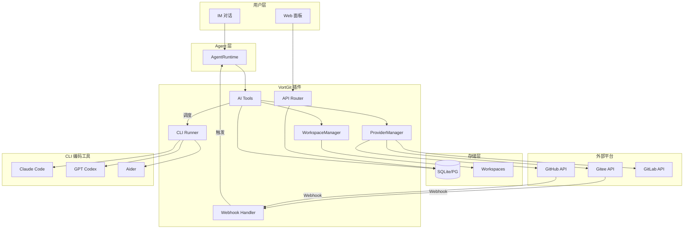

# VortGit — Git 仓库管理插件设计方案

> 状态：Phase 3 已完成（AI 编码能力），Phase 4 部分完成 | 创建日期：2026-03-01

## 一、整体架构

独立插件 `vortgit`，遵循 OpenVort 插件规范（`BasePlugin`），通过 `entry_points` 注册。与 VortFlow 深度集成（通过 `project_id` 外键），但不强依赖。



## 二、目录结构

```
src/openvort/plugins/vortgit/
├── __init__.py              # 导出 VortGitPlugin
├── plugin.py                # 插件主类（含 CLI 工具按需安装检测）
├── models.py                # 数据库模型（6 张表）
├── config.py                # VortGitSettings
├── crypto.py                # Token 加密/解密（Fernet）
├── router.py                # FastAPI API 路由
├── workspace.py             # WorkspaceManager（shallow clone/branch/pull/push）
├── cli_runner.py            # CLI 编码工具运行器 + 安装检测 + 按需安装
├── providers/
│   ├── __init__.py
│   ├── base.py              # GitProviderBase 抽象基类
│   ├── gitee.py             # Gitee REST API（首期）
│   ├── github.py            # GitHub REST API（Phase 4）
│   └── gitlab.py            # GitLab REST API（Phase 4）
├── tools/
│   ├── __init__.py
│   ├── repos.py             # git_list_repos, git_repo_info
│   ├── commits.py           # git_query_commits, git_work_summary（多维度）
│   └── coding.py            # git_code_task, git_commit_push, git_create_pr
└── prompts/
    └── git_guide.md         # 领域知识 prompt

web/src/views/vortgit/
├── Repos.vue                # 仓库列表（轻量卡片式）
├── RepoDetail.vue           # 仓库详情（Phase 4）
└── Providers.vue            # Git 平台 + CLI 编码工具配置
```

## 三、数据模型

### 3.1 `git_providers` — Git 平台配置

| 字段 | 类型 | 说明 |
|------|------|------|
| id | String(32) PK | UUID |
| name | String(64) | 显示名（如"公司 Gitee"） |
| platform | String(32) | gitee / github / gitlab / generic |
| api_base | String(512) | API 地址（如 `https://gitee.com/api/v5`） |
| access_token | Text | Fernet 加密存储的平台 Token |
| owner_id | String(32) FK→members | 创建者 |
| is_default | Boolean | 是否为默认平台 |
| created_at / updated_at | DateTime | 时间戳 |

### 3.2 `git_repos` — 仓库注册表

| 字段 | 类型 | 说明 |
|------|------|------|
| id | String(32) PK | UUID |
| provider_id | String(32) FK→git_providers | 所属平台 |
| project_id | String(32) FK→flow_projects, nullable | 关联的 VortFlow 项目（导入时引导关联） |
| name | String(128) | 仓库名 |
| full_name | String(256) | 完整路径（如 `org/repo`） |
| clone_url | String(512) | 克隆地址（HTTPS） |
| ssh_url | String(512) | SSH 地址 |
| default_branch | String(64) | 默认分支 |
| description | Text | 仓库描述 |
| language | String(64) | 主要语言 |
| repo_type | String(16) | frontend / backend / mobile / docs / infra / other |
| is_private | Boolean | 是否私有 |
| webhook_secret | String(128) | Webhook 签名密钥 |
| last_synced_at | DateTime | 最后同步时间 |
| created_at / updated_at | DateTime | 时间戳 |

### 3.3 `git_repo_members` — 仓库成员权限

| 字段 | 类型 | 说明 |
|------|------|------|
| id | String(32) PK | UUID |
| repo_id | String(32) FK→git_repos | 仓库 |
| member_id | String(32) FK→members | 成员 |
| access_level | String(16) | read / write / admin |
| platform_username | String(64) | 该成员在 Git 平台上的用户名 |

### 3.4 `git_workspaces` — 成员工作空间

| 字段 | 类型 | 说明 |
|------|------|------|
| id | String(32) PK | UUID |
| repo_id | String(32) FK→git_repos | 仓库 |
| member_id | String(32) FK→members | 成员 |
| local_path | String(512) | 本地克隆路径 |
| current_branch | String(128) | 当前分支 |
| status | String(16) | idle / busy / error |
| disk_usage_mb | Integer | 磁盘占用（MB） |
| last_used_at | DateTime | 最后使用时间 |

### 3.5 `git_code_tasks` — AI 编码任务历史

| 字段 | 类型 | 说明 |
|------|------|------|
| id | String(32) PK | UUID |
| repo_id | String(32) FK→git_repos | 目标仓库 |
| member_id | String(32) FK→members | 发起人 |
| story_id | String(32) nullable | 关联需求 |
| task_id | String(32) nullable | 关联任务 |
| cli_tool | String(32) | CLI 工具 |
| task_description | Text | 任务描述 |
| branch_name | String(128) | 工作分支 |
| status | String(16) | pending / running / success / failed / review |
| pr_url | String(512) | PR 链接 |
| files_changed | Text | 修改文件列表（JSON） |
| diff_summary | Text | 变更摘要 |
| cli_stdout / cli_stderr | Text | CLI 输出 |
| duration_seconds | Integer | 执行耗时 |
| created_at | DateTime | 创建时间 |

## 四、分阶段实施计划

### Phase 1: 基础框架 + 仓库管理
- 插件骨架 + 数据模型 + Token 加密
- Provider 抽象层 + GiteeProvider
- API 路由（平台/仓库 CRUD + 导入）
- 轻量前端（Providers.vue, Repos.vue）

### Phase 2: AI 读取能力（核心差异化）
- AI Tools：git_list_repos, git_repo_info, git_query_commits
- 多维度 git_work_summary（Git + VortFlow 联合分析）
- 领域知识 prompt

### Phase 3: AI 编码能力
- WorkspaceManager + CLI 按需安装 + cli_runner
- git_code_tasks 历史表 + git_code_task Tool（产出 PR）
- 权限校验

### Phase 4: 生态闭环
- VortFlow 深度集成 + Webhook 事件驱动
- RepoDetail.vue + GitHub/GitLab Provider
- Workspace 清理 + 磁盘告警
