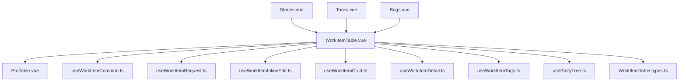

# VortFlow 工作项前端架构参考

本文档是 `vortflow-component-architecture` Skill 的补充材料，提供更具体的拆分建议、模块关系和 composable 签名参考。

## 现状问题

当前 VortFlow 工作项模块存在两个典型大文件：

- `web/src/views/vortflow/WorkItemTable.vue`
- `web/src/components/vort-biz/pro-table/ProTable.vue`

其中 `WorkItemTable.vue` 已经同时承载：

- 页面筛选
- 列表请求
- mock 数据构建
- API 数据映射
- 行内编辑
- 创建/删除
- 详情抽屉
- 评论/日志
- 树形展开
- 标签管理

这会导致：

- 新功能很难判断应该加在哪
- 同一职责分散在多个区块
- 回滚逻辑和显示逻辑耦合
- 页面组件无法保持稳定边界

## 建议目录结构

```text
web/src/views/vortflow/
├── WorkItemTable.vue
└── work-item/
    ├── WorkItemCreate.vue
    ├── WorkItemDetail.vue
    ├── useWorkItemCommon.ts
    ├── useWorkItemRequest.ts
    ├── useWorkItemInlineEdit.ts
    ├── useWorkItemCrud.ts
    ├── useWorkItemDetail.ts
    ├── useWorkItemTags.ts
    └── useStoryTree.ts
```

## 模块关系图



## 页面层应该保留什么

`WorkItemTable.vue` 应尽量只保留以下内容：

- `props`
- 路由联动
- 抽屉开关
- `columns` 组装
- `queryParams` 组装
- `rowSelection` 装配
- slot 模板
- 对 composable 的调用与转发

可以把它理解为“页面编排器”，而不是“业务仓库”。

## 各 composable 建议职责

### `useWorkItemRequest.ts`

负责：

- mock 数据构造
- API / mock 双模式切换
- 请求参数适配
- 多状态合并请求
- `mapBackendItemToRow`
- `prependPinnedRow`
- `cacheStoryRows`
- `getVisibleStoryRows`

建议对外签名：

```ts
export interface UseWorkItemRequestOptions {
    props: WorkItemTableProps;
    owner: Ref<string>;
    type: Ref<WorkItemType | "">;
    status: Ref<string>;
    tableRef: Ref<{ refresh?: () => void } | null>;
    common: ReturnType<typeof useWorkItemCommon>;
}

export function useWorkItemRequest(options: UseWorkItemRequestOptions) {
    return {
        totalCount,
        allData,
        apiProjects,
        apiStories,
        request,
        queryParams,
        rebuildMockDataset,
        loadApiMetadata,
        resolveActiveType,
        currentStatusFilterOptions,
        storyRowsById,
        storyChildrenMap,
        pinnedRowsByType,
    };
}
```

### `useWorkItemInlineEdit.ts`

负责：

- 各列 picker 开关状态
- `getRowPriority` / `selectPriority`
- `getRowStatus` / `selectRowStatus`
- `getRowOwner` / `selectRowOwner`
- `getRowCollaborators` / `setRowCollaborators`
- `getRowPlanTime` / `onPlanTimeChange`
- 字段更新的乐观写入与失败回滚

建议对外签名：

```ts
export function useWorkItemInlineEdit(options: {
    common: ReturnType<typeof useWorkItemCommon>;
    syncRecordUpdateToApi: (record: RowItem, patch: Record<string, unknown>) => Promise<void>;
    syncRecordStatusToApi: (record: RowItem, status: Status) => Promise<void>;
}) {
    return {
        priorityPickerOpenMap,
        statusPickerOpenMap,
        ownerPickerOpenMap,
        collaboratorsPickerOpenMap,
        openPlanTimeFor,
        getInteractiveCellKey,
        openCellPickerOnBackgroundClick,
        getRowPriority,
        selectPriority,
        getRowStatus,
        selectRowStatus,
        getRowOwner,
        selectRowOwner,
        getRowCollaborators,
        setRowCollaborators,
        getRowPlanTime,
        getRowPlanTimeText,
        togglePlanTimeMenu,
        onPlanTimeChange,
    };
}
```

### `useWorkItemCrud.ts`

负责：

- 新建表单初始化
- 删除单条
- 批量删除
- 提交创建
- 新建后更新本地列表或 pinned 数据

建议对外签名：

```ts
export function useWorkItemCrud(options: {
    props: WorkItemTableProps;
    tableRef: Ref<{ refresh?: () => void } | null>;
    requestState: ReturnType<typeof useWorkItemRequest>;
    common: ReturnType<typeof useWorkItemCommon>;
}) {
    return {
        createWorkItemRef,
        createBugForm,
        createBugAttachments,
        createAttachmentInputRef,
        createParentStoryId,
        createProjectId,
        resetCreateBugForm,
        handleCreateBug,
        handleCreateChildStory,
        handleCancelCreateBug,
        handleCancelCreateWorkItem,
        handleSubmitCreateBug,
        handleBatchDelete,
        deleteOne,
        openCreateAttachmentDialog,
        onCreateAttachmentChange,
        removeCreateAttachment,
    };
}
```

### `useWorkItemDetail.ts`

负责：

- 详情抽屉当前记录
- 评论列表
- 日志列表
- 描述编辑
- 父子关联工作项加载

建议对外签名：

```ts
export function useWorkItemDetail(options: {
    tableRef: Ref<{ refresh?: () => void } | null>;
    syncRecordUpdateToApi: (record: RowItem, patch: Record<string, unknown>) => Promise<void>;
    loadStoryById: (storyId?: string) => Promise<RowItem | null>;
    loadChildStories: (parentStoryId: string, projectId?: string) => Promise<RowItem[]>;
}) {
    return {
        detailSelectedWorkNo,
        detailCurrentRecord,
        detailActiveTab,
        detailBottomTab,
        detailParentRecord,
        detailChildRecords,
        detailComments,
        detailLogs,
        detailCommentDraft,
        detailDescEditing,
        detailDescDraft,
        handleOpenBugDetail,
        handleDetailUpdate,
        submitDetailComment,
        openDetailDescEditor,
        cancelDetailDescEditor,
        saveDetailDescEditor,
    };
}
```

### `useWorkItemTags.ts`

负责：

- 标签颜色
- 标签选项集合
- 标签折叠显示
- 新建标签弹窗
- `setRowTags`

建议对外签名：

```ts
export function useWorkItemTags(options: {
    syncRecordUpdateToApi: (record: RowItem, patch: Record<string, unknown>) => Promise<void>;
}) {
    return {
        tagPickerOpenMap,
        rowTagOptions,
        newTagDialogOpen,
        newTagName,
        newTagColor,
        getTagColor,
        getRowTags,
        getTagRenderInfo,
        setRowTags,
        openCreateTagDialog,
        handleCancelCreateTag,
        handleConfirmCreateTag,
        collectTagOptions,
    };
}
```

### `useStoryTree.ts`

负责：

- `expandedStoryIds`
- `expandingStoryIds`
- 子需求缓存
- 展开和收起行为

建议对外签名：

```ts
export function useStoryTree(options: {
    props: WorkItemTableProps;
    loadChildStories: (parentStoryId: string, projectId?: string) => Promise<RowItem[]>;
    createOwnerMatcher: (ownerValue: string) => { ownerMemberId: string; matchOwner: (row: RowItem) => boolean };
}) {
    return {
        expandedStoryIds,
        expandingStoryIds,
        toggleStoryExpand,
        getVisibleStoryRows,
    };
}
```

## `WorkItemTable.vue` 推荐编排顺序

建议固定成下面的阅读顺序：

1. import
2. props / route / router
3. `useWorkItemCommon()`
4. 页面基础 `ref`
5. `tableRef`
6. `useWorkItemRequest()`
7. `useStoryTree()`
8. `useWorkItemInlineEdit()`
9. `useWorkItemTags()`
10. `useWorkItemCrud()`
11. `useWorkItemDetail()`
12. `columns`
13. `rowSelection`
14. 生命周期与 watcher

这样阅读时可以很快定位职责，不会在一个文件里反复跳转 1000 行。

## ProTable 的推荐拆分

`ProTable.vue` 当前聚合的能力过多，未来扩展按下面边界拆：

```text
components/vort-biz/pro-table/
├── ProTable.vue
├── types.ts
├── useColumnWidth.ts
├── useColumnResize.ts
├── useFixedColumns.ts
├── useScrollShadow.ts
└── useHeaderTree.ts
```

### 推荐边界

- `useColumnWidth.ts`：最小宽度、文本测量、标题列例外规则
- `useColumnResize.ts`：拖拽、鼠标事件、宽度写回
- `useFixedColumns.ts`：fixed left/right offset、boundary class、sticky style
- `useScrollShadow.ts`：滚动阴影、scroll state、ResizeObserver
- `useHeaderTree.ts`：多级表头、leaf columns、header rows

## 拆分优先级

如果只能逐步拆，不必一次做完。优先级如下：

1. 先把新增功能放进新 composable，阻止继续膨胀
2. 再把最常改的职责抽离
3. 最后再处理 `ProTable.vue` 的内部拆分

## 审查清单

对 VortFlow 工作项相关改动做自检时，至少检查：

- 新增逻辑有没有直接堆进 `WorkItemTable.vue`
- 是否把 API 细节放进了展示组件
- 是否把业务判断写进了 `ProTable.vue`
- getter/setter 是否分散在多个文件
- 是否出现新的 `xxxMap + xxxHandler + xxxRollback` 散落实现
- 页面文件是否仍然能被快速读懂

## 允许的例外

以下情况允许留在页面组件：

- 只影响单个 slot 的极短格式化逻辑
- 一次性 UI 状态，且不会复用
- 与路由和抽屉可见性强绑定的页面状态

如果一段代码满足以下任一条件，就不算“例外”，应拆分：

- 超过 30 行
- 包含 API 调用
- 包含失败回滚
- 需要被两个以上字段复用
- 未来很可能继续扩展
