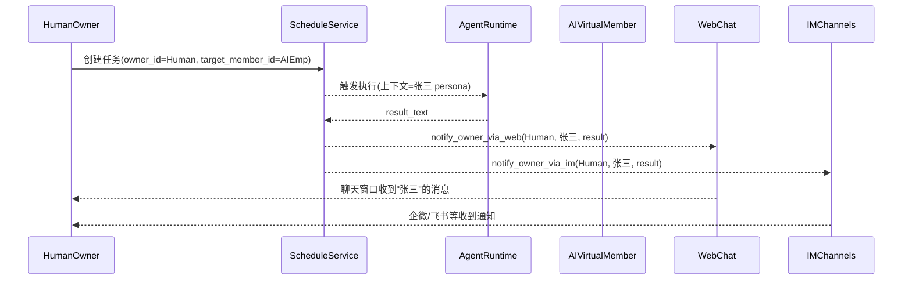

# OpenVort 架构设计文档

> 本文档是 OpenVort 项目的核心架构参考。涉及架构变动时必须同步更新此文档。

## 项目定位

OpenVort 是一个开源 AI 研发工作流引擎，通过 IM（企业微信/钉钉/飞书）与 AI Agent 交互，自动化项目管理、代码仓库、团队协作等研发流程。

核心理念：**一切皆插件**，所有业务能力通过插件提供，引擎本身只负责消息路由、Agent 调度和插件编排。

## 技术栈

| 层面 | 选型 |
|------|------|
| 语言 | Python 3.11+ |
| LLM | Anthropic Claude（tool use）+ OpenAI 兼容协议（Failover） |
| Web 框架 | FastAPI（Web 面板 / Webhook） |
| CLI | Click |
| HTTP 客户端 | httpx（异步） |
| ORM | SQLAlchemy 2.0 + asyncpg（PostgreSQL） |
| 数据库建表 | SQLAlchemy create_all（自动建表） |
| 配置 | Pydantic Settings（.env + 环境变量 + DB 配置三级优先） |
| 定时任务 | APScheduler |
| 前端 | Vue 3.5 + TypeScript 5.9 + Vite 7 + Tailwind CSS 4 + Pinia 3 |
| 包管理 | hatchling（PEP 621） |
| 代码规范 | Ruff |
| 协议 | Apache-2.0 |

## 核心架构

```
用户 ──→ IM 平台 ──→ Channel 适配器 ──→ Dispatcher ──→ Agent Runtime ──→ Plugin Tools ──→ 外部系统
     (企微/钉钉/飞书)   │                  (防抖/去重)     ↕    ↕              (禅道/Gitee/...)
                        │                            LLM(Claude)  │
                        │                                ↕        │
                        │                         Plugin Prompts  │
                        │                        (领域知识注入)    │
                        │                              ↕          │
          Web 面板 ─────┤                         Skill 系统      │
         (Vue 3 SPA)    │                        (知识片段注入)    │
                        └─────────────────────────────────────────┘
```

### 分层说明

```
src/openvort/
├── config/                 # 全局配置（Pydantic Settings）
│   └── settings.py         # Settings / LLMSettings / WeComSettings / WebSettings / ...
├── core/                   # 引擎核心（不含业务逻辑）
│   ├── agent.py            # AgentRuntime — Claude tool use agentic loop + thinking + usage
│   ├── llm.py              # LLMClient — 多 Provider + Failover
│   ├── context.py          # RequestContext — 请求上下文
│   ├── session.py          # SessionStore — 对话历史 + compact + per-session 设置
│   ├── commands.py         # CommandHandler — IM 聊天命令处理
│   ├── router.py           # AgentRouter — 多 Agent 路由
│   ├── group.py            # GroupActivation — 群聊激活模式
│   ├── pairing.py          # PairingManager — DM 配对安全
│   ├── sandbox.py          # SandboxManager — Docker 沙箱
│   ├── dispatcher.py       # MessageDispatcher — 消息防抖/去重
│   ├── session_tools.py    # Agent-to-Agent 通信工具
│   ├── bootstrap.py        # SetupCompleteTool — 首次启动向导
│   ├── setup.py            # SetupState — 初始化状态
│   ├── events.py           # EventBus — 事件总线
│   ├── scheduler.py        # Scheduler — APScheduler 定时任务
│   ├── schedule_service.py # ScheduleService — 定时任务业务层
│   └── coding_env.py       # CodingEnvironment — 编码执行环境
├── plugin/                 # 插件框架
│   ├── base.py             # BasePlugin / BaseChannel / BaseTool / Message
│   ├── registry.py         # PluginRegistry — Tool/Channel/Prompt 注册中心
│   └── loader.py           # PluginLoader — entry_points 自动发现
├── plugins/                # 内置插件
│   ├── zentao/             # 禅道插件（11 Tool + 4 Prompt，直连 MySQL）
│   ├── vortflow/           # VortFlow 项目管理（5 Tool + 2 Prompt，状态机驱动）
│   ├── vortgit/            # VortGit 代码仓库（8 Tool + 1 Prompt，AI 编码）
│   ├── report/             # 汇报管理（3 Tool + 1 Prompt，日报/周报/月报）
│   ├── browser/            # 浏览器控制（5 Tool，Playwright）
│   ├── jenkins/            # Jenkins CI/CD（6 Tool + 1 Prompt）
│   ├── schedule/           # 定时任务（2 Tool + 1 Prompt）
│   └── system/             # 系统管理（2 Tool + 1 Prompt，核心插件）
├── channels/               # IM 通道适配器
│   ├── wecom/              # 企业微信（智能机器人长连接 / Webhook）
│   ├── dingtalk/           # 钉钉（Stream 长连接 / Webhook + OpenAPI）
│   ├── feishu/             # 飞书（WebSocket 长连接 / Event Subscription + OpenAPI）
│   └── openclaw/           # OpenClaw 多平台网关
├── contacts/               # 通讯录（5 Tool，多平台身份映射）
├── skill/                  # Skill 知识注入系统（DB 驱动四级体系）
├── marketplace/            # 扩展市场集成
│   ├── client.py           # MarketplaceClient — HTTP client（搜索/安装/发布/Bundle 上下载）
│   └── installer.py        # MarketplaceInstaller — 安装/卸载/更新（Bundle + pip 双模式）
├── auth/                   # RBAC 权限（admin/manager/member/guest）
├── web/                    # Web 管理面板后端
│   ├── app.py              # FastAPI 应用工厂
│   ├── ws.py               # WebSocket（presence/typing/通知）
│   ├── webhooks.py         # Webhook 触发器
│   └── routers/            # API 路由（含 marketplace.py）
├── db/                     # SQLAlchemy 2.0 async（PostgreSQL + create_all）
│   ├── engine.py           # async engine + session factory + auto-migrate
│   └── models.py           # 基础 ORM 模型（Skill 含 marketplace_slug/version/hash）
├── skills/                 # 内置 Skill 示例
│   ├── code-review/        # 代码评审知识
│   └── daily-report/       # 日报知识
└── utils/
    └── logging.py          # 统一日志

web/                        # 前端（独立目录）
├── src/
│   ├── api/index.ts        # Axios 封装
│   ├── router/             # Vue Router + 菜单配置
│   ├── stores/             # Pinia（user/tabs/app/config/menu/plugin）
│   ├── layouts/            # BasicLayout + Header/Sidebar/Footer
│   └── views/              # 页面（chat/dashboard/vortflow/vortgit/reports/contacts/schedules/...）
├── package.json
└── vite.config.ts
```

## 核心概念

### Plugin（插件）

Plugin 是 OpenVort 的核心扩展单元，是 Tool + Prompt + Config 的容器。

```python
class BasePlugin(ABC):
    name: str           # "zentao"
    display_name: str   # "禅道项目管理"
    description: str
    version: str

    def get_tools(self) -> list[BaseTool]: ...
    def get_prompts(self) -> list[str]: ...
    def validate_credentials(self) -> bool: ...
    def get_config_schema(self) -> dict: ...
    def get_api_router(self): ...            # FastAPI 路由
    def get_ui_extensions(self) -> list: ... # 前端 UI 扩展
    def get_permissions(self) -> list: ...   # 自定义权限
    def get_roles(self) -> list: ...         # 自定义角色
```

通过 `pyproject.toml` 的 `entry_points` 自动发现：

```toml
[project.entry-points."openvort.plugins"]
zentao = "openvort.plugins.zentao:ZentaoPlugin"
vortflow = "openvort.plugins.vortflow:VortFlowPlugin"
vortgit = "openvort.plugins.vortgit:VortGitPlugin"
jenkins = "openvort.plugins.jenkins:JenkinsPlugin"
report = "openvort.plugins.report:ReportPlugin"
schedule = "openvort.plugins.schedule:SchedulePlugin"
system = "openvort.plugins.system:SystemPlugin"
```

### Tool（工具）

Tool 是 AI 可调用的原子操作，自动转换为 Claude tool use 格式。

```python
class BaseTool(ABC):
    name: str
    description: str
    required_permission: str = ""

    def input_schema(self) -> dict: ...
    async def execute(self, params) -> str: ...
```

### Channel（通道）

Channel 是 IM 平台适配器，负责消息收发和格式转换。

```python
class BaseChannel(ABC):
    name: str
    display_name: str

    async def start(self) -> None: ...
    async def stop(self) -> None: ...
    async def send(self, target, message) -> None: ...
    def on_message(self, handler) -> None: ...
    def is_configured(self) -> bool: ...
    async def test_connection(self) -> dict: ...
    def get_config_schema(self) -> dict: ...
    async def apply_config(self, config) -> dict: ...
```

### Agent Runtime

基于 Claude tool use 的 agentic loop，不依赖 LangChain 等框架：

```
用户消息 → 加载对话历史 → 拼接 system prompt + 插件 Prompt + Skill
    → 调用 Claude API（带 tools）
    → 如果 stop_reason == tool_use：执行工具 → 回传结果 → 继续循环
    → 如果 stop_reason == end_turn：返回文本回复
    → 保存对话历史 + 记录用量
```

### Web 聊天流式与中断

Web 聊天采用两段式链路，避免把大 payload 放在 SSE query：

```
POST /api/chat/send (content/images/session_id) → 返回 message_id
GET  /api/chat/stream/{message_id}             → SSE 持续推送
POST /api/chat/abort (message_id)              → 主动中断生成
```

中断机制：
- `chat.py` 维护运行中消息表（按 `message_id`）和 `cancel_event`
- `/api/chat/abort` 设置取消信号并触发流任务取消
- `AgentRuntime.process_stream_web(..., cancel_event=...)` 在 LLM 流和工具执行循环中协作检查取消，并回收工具子任务
- SSE 返回 `interrupted` 事件，前端将消息收敛为“已中断”状态

### LLMClient

统一 LLM 调用层，支持多 Provider + Failover：

```python
class LLMClient:
    def __init__(self, models: list[dict])               # 模型链（主 + fallback）
    async def create(*, system, messages, tools, thinking) # 同步调用（自动 failover）
    def stream(*, system, messages, tools, thinking)       # 流式调用

class AnthropicProvider(LLMProvider): ...
class OpenAICompatibleProvider(LLMProvider): ...
```

## 已实现功能

| 模块 | 功能 | 状态 |
|------|------|------|
| 引擎核心 | AgentRuntime + LLMClient + SessionStore + EventBus + Scheduler | ✅ |
| 引擎核心 | AgentRouter + IM 命令 + Agent 间通信 + MessageDispatcher | ✅ |
| 插件框架 | BasePlugin / BaseTool / BaseChannel + Registry + Loader + Prompt + Skill | ✅ |
| Channel | 企微 + 钉钉 + 飞书 + OpenClaw 网关 | ✅ |
| Plugin | 系统管理(2) + 禅道(11) + 浏览器(5) + 通讯录(5) + VortFlow(5) + VortGit(8) + 汇报(3) + Jenkins(6) + Schedule(2) | ✅ |
| Web | 管理面板（Vue 3 + FastAPI + JWT + SSE + WebSocket + Webhook） | ✅ |
| 安全 | RBAC + DM 配对 + Docker 沙箱 + Token 加密 | ✅ |
| 基础设施 | CLI + Pydantic Settings + 异步全栈 | ✅ |
| AI 员工 | Member 扩展 + 角色模板 Skills + Agent 人设注入 + 定时汇报 + 远程工作节点 + Webhook 外部连接 | ✅ |

## 设计决策记录

### 为什么不用 LangChain？

保持轻量可控。Claude tool use 原生 API 已经足够强大，agentic loop 只需约 50 行代码。引入 LangChain 会增加大量依赖和抽象层，对于我们的场景（IM → Agent → Tool）过于重量级。

### 为什么 Plugin 而不是散装 Tool？

参考 Dify、Coze、Semantic Kernel 的设计，Plugin 作为容器可以：
- 统一管理凭证（一个禅道连接供所有 Tool 共享）
- 附带领域知识（Prompt 自动注入）
- 独立发布为 pip 包
- 一键启用/禁用整组功能

### 为什么用 entry_points 而不是目录扫描？

Python entry_points 是标准的插件发现机制：
- 第三方插件 `pip install openvort-plugin-xxx` 即可自动注册
- 内置插件和外部插件使用同一套机制
- 不需要约定目录结构或配置文件

补充：`PluginLoader` 对内置通道增加了兜底加载逻辑，确保开发环境下即使 entry_points 未正确安装也能注册。

### AI 员工能力扩展

AI 员工通过两个互补的能力维度扩展工作范围：

#### 远程工作节点（Outbound）

让 AI 员工拥有一台"工作电脑"，可在远程机器上执行编码、命令行、文件操作等实际任务。

- **关联方式**：`Member.remote_node_id` 一对一绑定
- **通信协议**：WebSocket（OpenClaw Gateway v3）
- **调用链**：用户指令 -> Agent 调用 `remote_work` Tool -> `RemoteNodeService` -> `OpenClawExecutor` -> WebSocket -> 远程机器执行 -> 返回结果
- **可插拔**：通过 `RemoteNodeExecutor` Protocol 支持不同类型的远程节点后端
- **创建时可选**：创建 AI 员工向导中可直接绑定，也可稍后在详情页配置

#### Webhook 外部连接（Inbound）

让 AI 员工"听到"外部系统的事件，自动响应并处理。

- **关联方式**：`WebhookConfig.member_id` 可选绑定特定 AI 员工
- **支持三种模式**：`agent_chat`（事件转 prompt 交 Agent 处理）、`openclaw_bridge`（跨平台 IM 桥接）、`notify`（通知回调）
- **内置模板**：OpenClaw（全球 IM 桥接）、GitHub（Push/PR/Issue 事件）、GitLab（Push/MR/Pipeline 事件）
- **典型场景**：GitHub 推送代码 -> AI 自动 Code Review；OpenClaw 桥接 WhatsApp 消息 -> AI 员工自动回复

两者独立且互补：远程节点让 AI 员工"有手能干活"，Webhook 让 AI 员工"有耳能听事"。一个完整的全能型 AI 员工两者都需要。

### AI 员工任务归属与通知机制

#### 核心概念

- **Owner（任务拥有者/汇报接收人）**：真实成员，负责创建任务、接收结果通知。
- **Executor（执行人）**：可以是 AI 员工（虚拟 Member）或系统默认 Agent。
- **Channel（通知通道）**：Web Chat 会话、企业微信/钉钉/飞书等。

#### ScheduleJob 字段语义

| 字段 | 语义 | 说明 |
|------|------|------|
| `owner_id` | 任务拥有者 | 谁创建任务、谁会收到通知 |
| `target_member_id` | 执行人 | 绑定的 AI 员工 ID，为空则由系统默认 Agent 执行 |

#### 执行流程



#### 关键实现

1. **执行上下文构建**：基于 `target_member_id` 查询 Member，构建完整的 RequestContext，让 AgentRuntime 自动注入 AI 员工人设。
2. **统一通知接口**：`notify_fn(owner_id, job_name, result_text)` 负责将执行结果推送给任务拥有者，支持 Web Chat 和 IM 通道。
3. **Web Chat 通知**：通过 SSE/WebSocket 向 owner 的聊天会话推送以 AI 员工身份发送的消息。
4. **IM 通知**：基于 PlatformIdentity 映射找到 owner 在各平台的账号，调用对应 Channel 的单聊消息接口。
